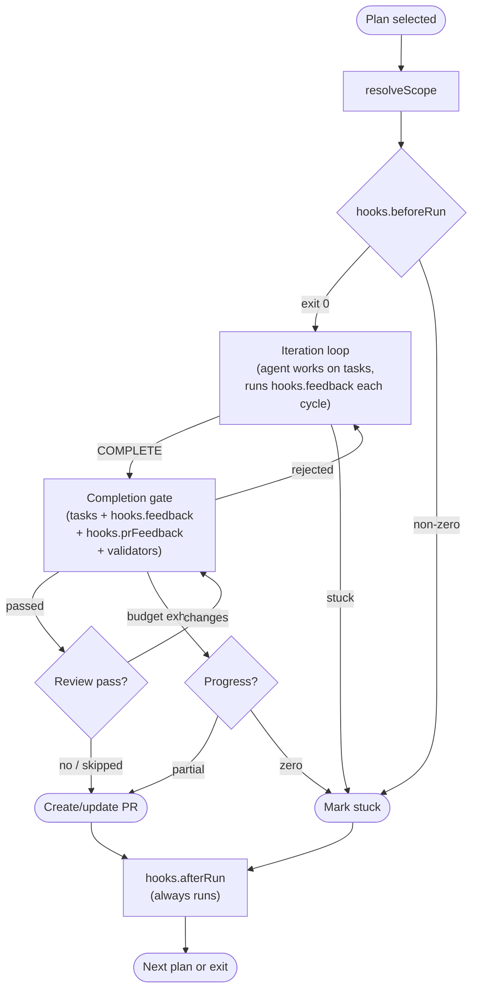
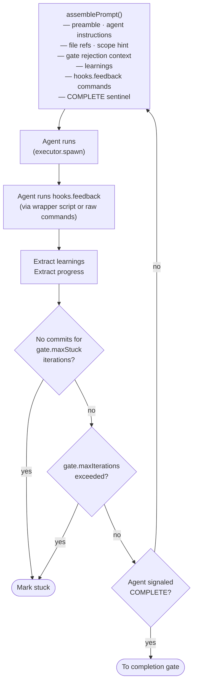
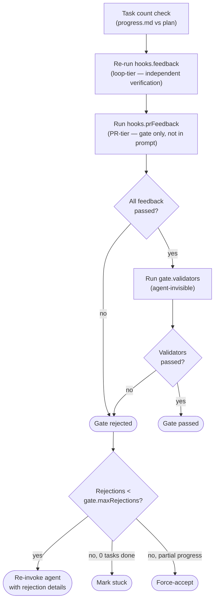
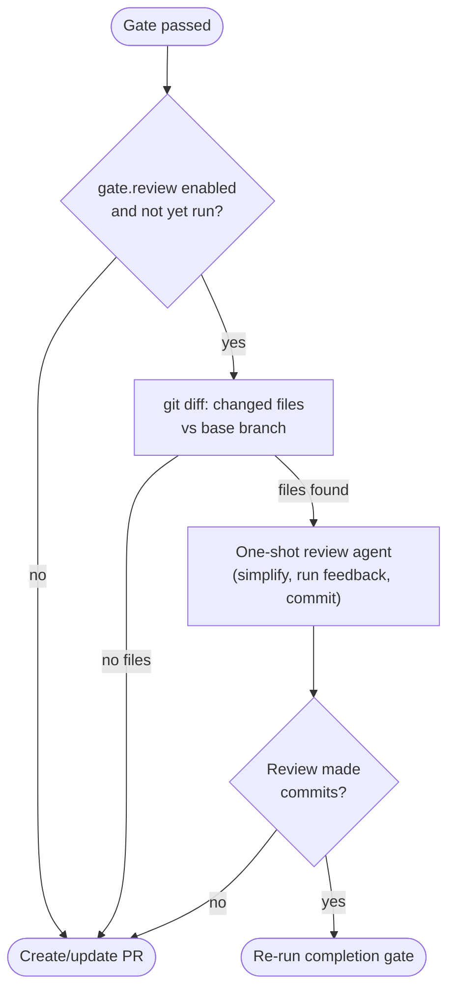

# Hooks, Gates, and Prompt Controls

Extension points for customizing Ralphai's behavior: lifecycle hooks, completion gate configuration, prompt injection, PR settings, git options, and issue tracking.

Back to the [README](../README.md) for setup and quickstart. See the [CLI Reference](cli-reference.md) for all commands and flags. See [How Ralphai Works](how-ralphai-works.md) for the core loop mechanics.

## Lifecycle Overview

The diagrams below show every hook, gate check, and prompt injection point in firing order. Workspace overrides are resolved once per plan before the iteration loop begins.

### High-Level Flow



### Iteration Loop Detail

Each iteration starts a fresh agent session. `hooks.feedback` commands are included in the prompt so the agent runs them during its work — this is the fast, every-cycle feedback tier.



### Completion Gate Detail

When the agent signals COMPLETE, the runner independently re-runs `hooks.feedback`, then runs `hooks.prFeedback` (the slow, gate-only tier), then validators. The agent does not see `hooks.prFeedback` or validators in its prompt — they only run here.



### Review Pass Detail

After the gate passes, an optional one-shot review pass performs behavior-preserving simplifications. Runs at most once per plan.



## Config Reference

Settings resolve in this order: **CLI flags > env vars > `config.json` > defaults**. Use `ralphai config` to see every resolved value and its source.

### `hooks.*` — Lifecycle Hooks

| Key                     | Default           | Env Var                          | CLI Flag                         | Description                                                                                                           |
| ----------------------- | ----------------- | -------------------------------- | -------------------------------- | --------------------------------------------------------------------------------------------------------------------- |
| `hooks.feedback`        | _(auto-detected)_ | `RALPHAI_HOOKS_FEEDBACK`         | `--hooks-feedback=<list>`        | Comma-separated loop-tier feedback commands (build, test, lint). Included in the agent prompt; run every iteration.   |
| `hooks.prFeedback`      | `""`              | `RALPHAI_HOOKS_PR_FEEDBACK`      | `--hooks-pr-feedback=<list>`     | Comma-separated PR-tier feedback commands (E2E, integration). Run only at the completion gate, not during iterations. |
| `hooks.beforeRun`       | `""`              | `RALPHAI_HOOKS_BEFORE_RUN`       | `--hooks-before-run=<cmd>`       | Shell command to run once per plan before the iteration loop. Non-zero exit marks the plan stuck.                     |
| `hooks.afterRun`        | `""`              | `RALPHAI_HOOKS_AFTER_RUN`        | `--hooks-after-run=<cmd>`        | Shell command to run after each plan completes (or is stuck). Runs in a `finally` block — failure is a warning only.  |
| `hooks.feedbackTimeout` | `300`             | `RALPHAI_HOOKS_FEEDBACK_TIMEOUT` | `--hooks-feedback-timeout=<sec>` | Timeout in seconds for each feedback command at the completion gate. Default 300 (5 minutes).                         |

### `gate.*` — Completion Gate

| Key                     | Default | Env Var                          | CLI Flag                             | Description                                                                                                                  |
| ----------------------- | ------- | -------------------------------- | ------------------------------------ | ---------------------------------------------------------------------------------------------------------------------------- |
| `gate.maxStuck`         | `3`     | `RALPHAI_GATE_MAX_STUCK`         | `--gate-max-stuck=<n>`               | Consecutive no-commit iterations before marking stuck.                                                                       |
| `gate.review`           | `true`  | `RALPHAI_GATE_REVIEW`            | `--gate-review` / `--gate-no-review` | Enable review pass after gate passes. The review is a one-shot agent invocation for behavior-preserving cleanup.             |
| `gate.maxRejections`    | `2`     | `RALPHAI_GATE_MAX_REJECTIONS`    | `--gate-max-rejections=<n>`          | Max gate rejections before force-accept. Set to `0` to never force-accept (mark stuck instead).                              |
| `gate.maxIterations`    | `0`     | `RALPHAI_GATE_MAX_ITERATIONS`    | `--gate-max-iterations=<n>`          | Absolute cap on runner iterations. `0` = unlimited. Independent of `gate.maxStuck`.                                          |
| `gate.reviewMaxFiles`   | `25`    | `RALPHAI_GATE_REVIEW_MAX_FILES`  | `--gate-review-max-files=<n>`        | Max files to include in the review-pass prompt.                                                                              |
| `gate.validators`       | `""`    | `RALPHAI_GATE_VALIDATORS`        | `--gate-validators=<list>`           | Comma-separated validator commands. Run at the gate after all feedback passes. Agent-invisible — not included in the prompt. |
| `gate.iterationTimeout` | `0`     | `RALPHAI_GATE_ITERATION_TIMEOUT` | `--gate-iteration-timeout=<sec>`     | Per-agent-invocation timeout in seconds. `0` = no timeout. Timed-out iterations count toward the stuck budget.               |

### `prompt.*` — Prompt Controls

| Key                  | Default          | Env Var                       | CLI Flag                                       | Description                                                                                                                                                       |
| -------------------- | ---------------- | ----------------------------- | ---------------------------------------------- | ----------------------------------------------------------------------------------------------------------------------------------------------------------------- |
| `prompt.verbose`     | `false`          | `RALPHAI_PROMPT_VERBOSE`      | `--prompt-verbose`                             | When `false` (default), the prompt instructs the agent to use terse style (drop filler words, articles, pleasantries). `true` disables this instruction.          |
| `prompt.preamble`    | _(built-in)_     | `RALPHAI_PROMPT_PREAMBLE`     | `--prompt-preamble=<text>`                     | Custom preamble text injected at the top of every prompt. Replaces the built-in default entirely. Use `@path` to read from a file (e.g. `@.ralphai-preamble.md`). |
| `prompt.learnings`   | `true`           | `RALPHAI_PROMPT_LEARNINGS`    | `--prompt-learnings` / `--no-prompt-learnings` | Enable learnings extraction and injection. When `false`, the learnings mandate is omitted from the prompt and no `<learnings>` block is parsed.                   |
| `prompt.commitStyle` | `"conventional"` | `RALPHAI_PROMPT_COMMIT_STYLE` | `--prompt-commit-style=<style>`                | Commit message style instruction. `"conventional"` instructs the agent to use conventional commit format; `"none"` omits commit style guidance.                   |

### `agent.*` — Agent Commands

| Key                        | Default  | Env Var                             | CLI Flag                            | Description                                                                |
| -------------------------- | -------- | ----------------------------------- | ----------------------------------- | -------------------------------------------------------------------------- |
| `agent.command`            | _(none)_ | `RALPHAI_AGENT_COMMAND`             | `--agent-command=<cmd>`             | CLI command to invoke the coding agent (e.g. `claude -p`, `opencode run`). |
| `agent.interactiveCommand` | `""`     | `RALPHAI_AGENT_INTERACTIVE_COMMAND` | `--agent-interactive-command=<cmd>` | CLI command for interactive HITL sessions (e.g. `opencode`, `claude`).     |
| `agent.setupCommand`       | `""`     | `RALPHAI_AGENT_SETUP_COMMAND`       | `--agent-setup-command=<cmd>`       | Command to run in worktree after creation (e.g. `bun install`).            |

### `pr.*` — Pull Request

| Key        | Default | Env Var            | CLI Flag                       | Description                                                             |
| ---------- | ------- | ------------------ | ------------------------------ | ----------------------------------------------------------------------- |
| `pr.draft` | `true`  | `RALPHAI_PR_DRAFT` | `--pr-draft` / `--no-pr-draft` | Open PRs as drafts. Use `--no-pr-draft` to create ready-for-review PRs. |

### `git.*` — Git

| Key                | Default | Env Var                     | CLI Flag                       | Description                                                                           |
| ------------------ | ------- | --------------------------- | ------------------------------ | ------------------------------------------------------------------------------------- |
| `git.branchPrefix` | `""`    | `RALPHAI_GIT_BRANCH_PREFIX` | `--git-branch-prefix=<prefix>` | Branch name prefix. E.g. `ralphai/` produces branches like `ralphai/feat/my-feature`. |

### `issue.*` — Issue Tracking

| Key                     | Default                   | Env Var                           | CLI Flag                     | Description                                                          |
| ----------------------- | ------------------------- | --------------------------------- | ---------------------------- | -------------------------------------------------------------------- |
| `issue.source`          | `"none"`                  | `RALPHAI_ISSUE_SOURCE`            | —                            | Issue source: `"github"` or `"none"`. `init` defaults to `"github"`. |
| `issue.standaloneLabel` | `"ralphai-standalone"`    | `RALPHAI_ISSUE_STANDALONE_LABEL`  | —                            | Family label for standalone issues.                                  |
| `issue.subissueLabel`   | `"ralphai-subissue"`      | `RALPHAI_ISSUE_SUBISSUE_LABEL`    | —                            | Family label for PRD sub-issues.                                     |
| `issue.prdLabel`        | `"ralphai-prd"`           | `RALPHAI_ISSUE_PRD_LABEL`         | —                            | Family label for PRD parent issues.                                  |
| `issue.repo`            | _(auto-detected)_         | `RALPHAI_ISSUE_REPO`              | —                            | GitHub `owner/repo` for issue queries.                               |
| `issue.commentProgress` | `true`                    | `RALPHAI_ISSUE_COMMENT_PROGRESS`  | —                            | Post progress comments on GitHub issues during runs.                 |
| `issue.hitlLabel`       | `"ralphai-subissue-hitl"` | `RALPHAI_ISSUE_HITL_LABEL`        | `--issue-hitl-label=<label>` | Label marking sub-issues as requiring human interaction.             |
| `issue.inProgressLabel` | `"in-progress"`           | `RALPHAI_ISSUE_IN_PROGRESS_LABEL` | —                            | State label added when an issue is being worked on.                  |
| `issue.doneLabel`       | `"done"`                  | `RALPHAI_ISSUE_DONE_LABEL`        | —                            | State label added when work completes successfully.                  |
| `issue.stuckLabel`      | `"stuck"`                 | `RALPHAI_ISSUE_STUCK_LABEL`       | —                            | State label added when the agent gets stuck.                         |

### Top-Level Keys

| Key             | Default           | Env Var                   | CLI Flag                  | Description                                                                                                     |
| --------------- | ----------------- | ------------------------- | ------------------------- | --------------------------------------------------------------------------------------------------------------- |
| `baseBranch`    | `"main"`          | `RALPHAI_BASE_BRANCH`     | `--base-branch=<branch>`  | Base branch for worktree creation.                                                                              |
| `sandbox`       | _(auto-detected)_ | `RALPHAI_SANDBOX`         | `--sandbox=<mode>`        | Execution sandbox: `"none"` (local) or `"docker"` (containerized). Auto-detects Docker availability when unset. |
| `dockerImage`   | `""`              | `RALPHAI_DOCKER_IMAGE`    | `--docker-image=<image>`  | Override Docker image. Default: auto-resolve from agent name.                                                   |
| `dockerMounts`  | `""`              | `RALPHAI_DOCKER_MOUNTS`   | `--docker-mounts=<csv>`   | Extra bind mounts for Docker sandbox (comma-separated).                                                         |
| `dockerEnvVars` | `""`              | `RALPHAI_DOCKER_ENV_VARS` | `--docker-env-vars=<csv>` | Extra env vars to forward into Docker sandbox (comma-separated).                                                |
| `workspaces`    | `null`            | _(none)_                  | _(none)_                  | Per-package overrides for monorepos. See [Workspace Overrides](#workspace-overrides).                           |

## Examples

### Lifecycle Hooks

**Run a setup script before each plan:**

```json
{
  "hooks": {
    "beforeRun": "bun install && bun run db:migrate"
  }
}
```

If `hooks.beforeRun` exits non-zero, the plan is marked stuck immediately — the iteration loop never starts.

**Post-plan cleanup or notifications:**

```json
{
  "hooks": {
    "afterRun": "curl -X POST https://slack.example.com/webhook -d '{\"text\": \"Plan finished\"}'"
  }
}
```

`hooks.afterRun` runs in a `finally` block — it fires on completion, stuck, and interruption. A non-zero exit produces a warning but does not affect the outcome.

**Two-tier feedback — fast loop, slow gate:**

```json
{
  "hooks": {
    "feedback": "pnpm build,pnpm test",
    "prFeedback": "pnpm test:e2e",
    "feedbackTimeout": 600
  }
}
```

Loop-tier commands run every iteration and appear in the agent prompt. PR-tier commands run only at the completion gate. Both tiers must pass before a PR is created.

### Completion Gate

**Strict gate — never force-accept:**

```json
{
  "gate": {
    "maxRejections": 0,
    "maxStuck": 5
  }
}
```

With `gate.maxRejections: 0`, a failed gate always marks the plan stuck instead of force-accepting. Increase `gate.maxStuck` to give the agent more attempts.

**Add validators for secret scanning:**

```json
{
  "gate": {
    "validators": "trufflehog --only-verified ."
  }
}
```

Validators run at the completion gate after all feedback commands pass. They are agent-invisible — not included in the prompt — so the agent cannot game them. Validator failures are reported in the gate rejection details.

**Cap iterations for cost control:**

```json
{
  "gate": {
    "maxIterations": 20,
    "iterationTimeout": 600
  }
}
```

`gate.maxIterations` sets an absolute cap regardless of progress. `gate.iterationTimeout` kills individual agent invocations that exceed the limit.

### Prompt Controls

**Custom preamble from a file:**

```json
{
  "prompt": {
    "preamble": "@.ralphai-preamble.md"
  }
}
```

The `@` prefix reads the file relative to the repo root. The file content replaces the built-in preamble entirely.

**Verbose output for debugging:**

```bash
ralphai run --prompt-verbose
```

Disables the default terse instruction so the agent produces full, unabridged output. Useful for debugging agent behavior.

**Disable learnings:**

```json
{
  "prompt": {
    "learnings": false
  }
}
```

Removes the learnings mandate from the prompt and disables `<learnings>` extraction. The Learnings section is also omitted from PR bodies.

### Agent Instructions (Per-Plan)

Add a `## Agent Instructions` section to any plan file. This content is injected into the prompt after the preamble and before file references.

```markdown
---
scope: packages/web
---

# Add dark mode toggle

## Agent Instructions

Use the existing `ThemeContext` from `src/contexts/theme.tsx`. Do not introduce a new state management library. All new CSS must use CSS modules.

## Implementation Tasks

### Task 1: Add toggle component

...
```

Agent instructions are stripped from the plan content before it is passed to the agent as a file reference, so they appear only once (in the preamble area, not duplicated in the plan body).

## Plan Frontmatter Reference

Plan files support these YAML frontmatter fields:

| Field            | Type       | Description                                                                                                             |
| ---------------- | ---------- | ----------------------------------------------------------------------------------------------------------------------- |
| `scope`          | `string`   | Monorepo package path (e.g. `packages/web`). Rewrites feedback commands to target the scoped package.                   |
| `feedback-scope` | `string`   | Directory path for narrowing feedback focus (e.g. `src/components`). Overrides auto-detection from `## Relevant Files`. |
| `depends-on`     | `string[]` | Plan slugs or issue refs that must complete before this plan runs (e.g. `[foundation.md, gh-42]`).                      |
| `source`         | `string`   | Origin of the plan: `"github"` or `"manual"`.                                                                           |
| `issue`          | `number`   | GitHub issue number associated with this plan.                                                                          |
| `issue-url`      | `string`   | Full URL of the GitHub issue.                                                                                           |
| `prd`            | `number`   | Parent PRD issue number.                                                                                                |
| `priority`       | `number`   | Numeric priority (lower = runs sooner). Plans without `priority` get implicit `0`.                                      |
| `tags`           | `string[]` | Tags for filtering plans (e.g. `[frontend, auth]`). Use `--tags=frontend` to run only matching plans. OR semantics.     |

## Workspace Overrides

The `workspaces` key in `config.json` provides per-package overrides for monorepo projects. Each key is a relative path matching a plan's `scope` frontmatter value. Overridable fields: `feedbackCommands`, `prFeedbackCommands`, `validators`, `beforeRun`, `preamble`.

```json
{
  "hooks": {
    "feedback": "pnpm build,pnpm test",
    "prFeedback": "pnpm test:e2e",
    "beforeRun": "pnpm install"
  },
  "prompt": {
    "preamble": "@.ralphai-preamble.md"
  },
  "workspaces": {
    "packages/web": {
      "feedbackCommands": ["pnpm --filter web build", "pnpm --filter web test"],
      "prFeedbackCommands": ["pnpm --filter web test:e2e"],
      "validators": ["pnpm --filter web lint:strict"],
      "beforeRun": "pnpm --filter web install",
      "preamble": "@packages/web/.ralphai-preamble.md"
    },
    "packages/api": {
      "feedbackCommands": ["pnpm --filter api build"]
    }
  }
}
```

Resolution order per plan:

1. If the plan declares `scope: packages/web` and a matching `workspaces` entry exists, its fields are used.
2. Missing fields in the workspace entry inherit from the root config.
3. If no matching workspace entry exists, Ralphai derives scoped commands automatically (Node.js package manager filter or .NET path append).
4. Plans without `scope` use root-level config unchanged.

Workspace `preamble` also supports the `@path` syntax — the path is resolved relative to the repo root.
